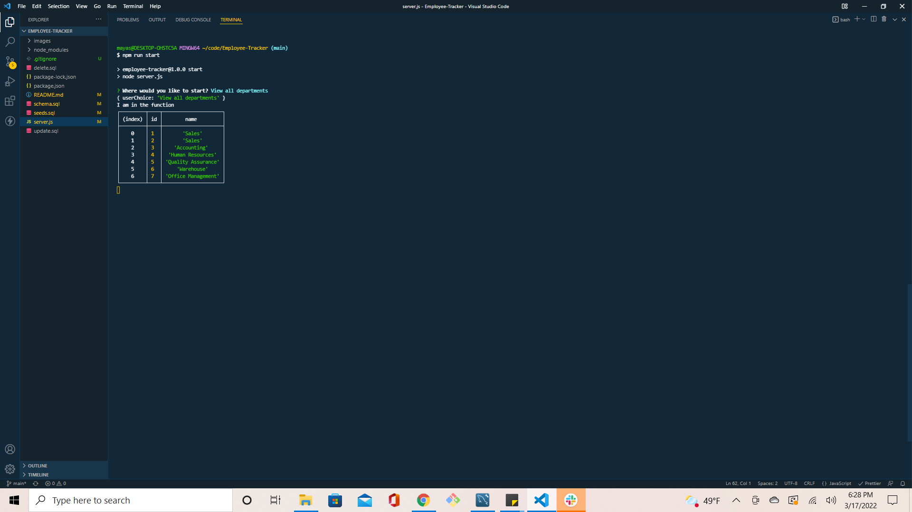

# 12 Employee-Tracker

## Description

The employee tracker allows the user to manage a company's employee database using Node.js, Inquirer, and MySQL. This application was created bu building a command-line application by scratch. To use, the user will follow a series a prompts that will have them input employee information. This information then will be able to view in table form, and will be updated in real time.

## Screenshot

## Link to Walkthrough Demo

- Here is the link to the demo: https://drive.google.com/file/d/11nHdfafmnhiR0lrHbwoO8QEzMGuQQMoy/view

## Links to Application

- Here is the repo : [mayaatil/repo](https://github.com/mayaatil/Employee-Tracker)
- Here is the pages: [mayaatil/pages](https://mayaatil.github.io/Employee-Tracker/)
